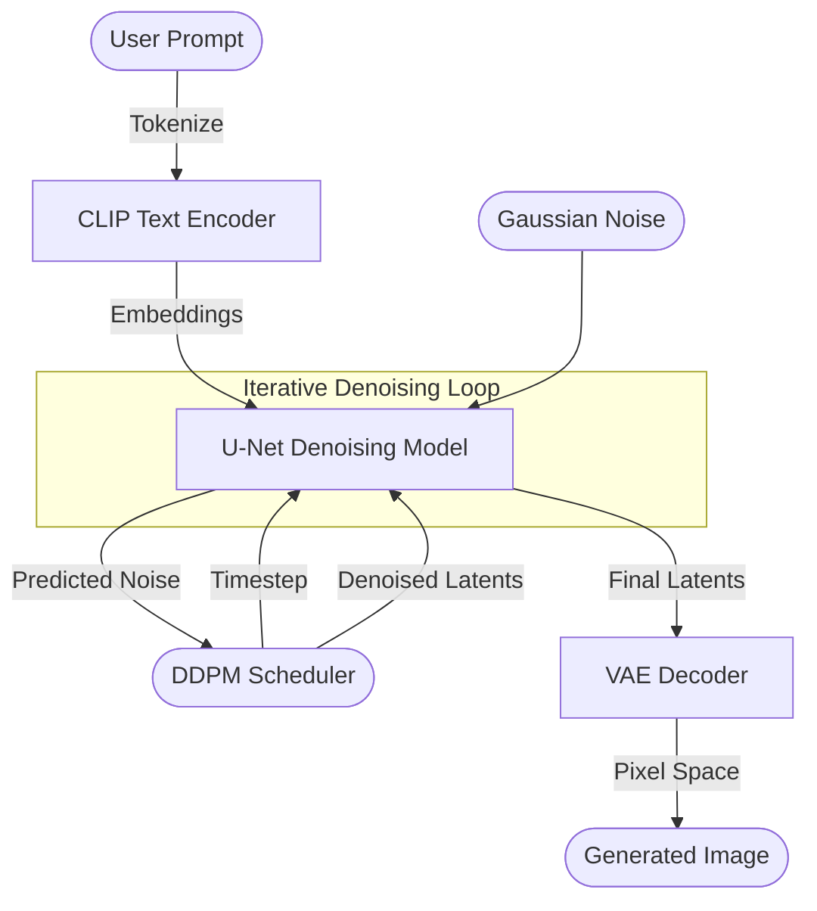

# reifusion: A Deep Dive into Stable Diffusion

**reifusion** is a pedagogical implementation of a Stable Diffusion pipeline, designed to peel back the layers of abstraction found in production libraries like `diffusers`. This project is optimised for **learning**. It breaks down the complex architecture of Latent Diffusion Models (LDMs) into understandable components, providing a clear mapping between the mathematical theory and the PyTorch implementation.

This codebase implements the core components of Stable Diffusion from scratch (mostly), including the VAE, U-Net, CLIP text encoder, and the DDPM scheduler.

## High-Level Architecture

The generation process involves the interplay of several neural networks.



---

## Theoretical Foundations & Mathematics

Stable Diffusion is a **Latent Diffusion Model (LDM)**. This means the diffusion process happens in a compressed "latent space" rather than pixel space, making it computationally feasible.

### 1. The Variational Autoencoder (VAE)
The VAE compresses an image $x$ into a latent representation $z = \mathcal{E}(x)$ and reconstructs it $\hat{x} = \mathcal{D}(z)$. 

In the encoder (`model/encoder.py`), we use the **Reparameterization Trick** to sample from the learned distribution:
$$z = \mu + \sigma \odot \epsilon, \quad \epsilon \sim \mathcal{N}(0, I)$$
Where $\mu$ is the mean and $\sigma$ is the standard deviation (derived from the log-variance). This makes the sampling process differentiable.

### 2. Diffusion Probabilistic Models (DDPM)
Diffusion models define a forward process (adding noise) and a reverse process (removing noise).

**Forward Process ($q$)**:
We gradually add Gaussian noise to a clean image $x_0$ over $T$ steps. At any timestep $t$, we can sample $x_t$ directly:
$$q(x_t | x_0) = \mathcal{N}(x_t; \sqrt{\bar{\alpha}_t} x_0, (1 - \bar{\alpha}_t)I)$$
where $\bar{\alpha}_t$ is the cumulative product of $\alpha_t = 1 - \beta_t$, and $\beta_t$ is the basic noise variance schedule. You can see this implemented in `model/ddpm.py`'s `add_noise` method.

**Reverse Process ($p_\theta$)**:
We train a neural network $\epsilon_\theta(x_t, t)$ (the U-Net) to approximate the noise added at that step. The denoising step is:
$$x_{t-1} = \frac{1}{\sqrt{\alpha_t}} \left( x_t - \frac{1-\alpha_t}{\sqrt{1-\bar{\alpha}_t}} \epsilon_\theta(x_t, t) \right) + \sigma_t z$$
This logic is the core of `DDPMSampler.step`.

### 3. Attention Mechanism
The U-Net uses both **Self-Attention** (spatial context) and **Cross-Attention** (text conditioning).

The core formula is **Scaled Dot-Product Attention**:
$$\text{Attention}(Q, K, V) = \text{softmax}\left(\frac{QK^T}{\sqrt{d_k}}\right)V$$

- **Q (Query)**: What I am looking for? (From image features)
- **K (Key)**: What do I have? (From image features for Self-Attention, from Text Prompts for Cross-Attention)
- **V (Value)**: What features do I pass on? (Same source as K)

### 4. Classifier-Free Guidance (CFG)
To force the model to follow the prompt more strictly, we perform two forward passes: one with the prompt ($\epsilon_{cond}$) and one without ($\epsilon_{uncond}$). We then extrapolate:
$$\epsilon_{pred} = \epsilon_{uncond} + s \cdot (\epsilon_{cond} - \epsilon_{uncond})$$
where $s$ is the guidance scale (typically 7.5). This pushes the result away from the "generic" image towards the "prompt-specific" image.

---

## 🔍 Codebase Deep Dive

### `model/attention.py`
Contains the building blocks for the transformer layers.
- **`SelfAttention`**: Enables pixels to relate to other pixels in the same image. Crucial for structure.
- **`CrossAttention`**: Enables pixels to pay attention to the text description. This is where the prompt enters the image generation process. The `forward` method takes `x` (latent features) and `y` (text embeddings).

### `model/clip.py`
Implements a simplified version of OpenAI's CLIP text encoder.
- **`CLIPEmbedding`**: Converts text tokens into dense vectors and adds positional embeddings.
- **`CLIPLayer`**: A standard transformer encoder block.
- It processes the text prompt into a sequence of vectors (77 tokens x 768 dimensions) used by the Cross-Attention layers.

### `model/diffusion.py` (The U-Net)
This is the workhorse of the system.
- **`TimeEmbedding`**: The model needs to know *specifically* which diffusion step $t$ it is currently denoising. We use sinusoidal embeddings (similar to positional encodings) to represent $t$.
- **`UNeti`**: A "U" shaped network with downsampling (Encoder) and upsampling (Decoder) paths.
- **`SwitchSequential`**: A helper class that routes inputs differently depending on whether the layer needs `context` (Attention) or `time` (Residual blocks).
- **Skip Connections**: Concatenates features from the downsampling path to the upsampling path to preserve high-frequency details.

### `model/ddpm.py` (The Scheduler)
Handles the math of the diffusion process, decoupled from the neural network.
- **`DDPMSampler`**: Manage `betas` ($\beta$), `alphas` ($\alpha$), and `alphas_cumprod` ($\bar{\alpha}$).
- **`step()`**: Performs one step of denoising using formulas derived from the DDPM paper (Equation 15).
- **`add_noise()`**: Used during training (or for image-to-image) to corrupt an image with noise.

### `model/encoder.py` & `model/decoder.py` (VAE)
- **Encoder**: Compresses a $512 \times 512 \times 3$ image into a $64 \times 64 \times 4$ latent tensor. This 48x compression makes diffusion faster.
- **Decoder**: Blows the $64 \times 64 \times 4$ latent back up to a full RGB image.
- **Why 4 channels?** The latent space has 4 channels, learning abstract representations of the image content.

### `model/pipeline.py`
The conductor that orchestrates the entire show.
- **`generate()`**:
    1.  **Text Encoding**: Uses CLIP to embed the prompt.
    2.  **Latent Initialization**: Starts with random Gaussian noise $N(0, I)$ (or an encoded input image).
    3.  **Denoising Loop**: Iterates for `n_inference_steps`.
        -   Calculates time embeddings.
        -   Runs the U-Net to predict noise.
        -   Applies CFG.
        -   Updates latents using the Scheduler.
    4.  **Decoding**: Passes the final latents through the VAE Decoder to get the result.

---

## Project Structure

```
reifusion/
├── model/
│   ├── attention.py   # Self and Cross Attention mechanisms
│   ├── clip.py        # Text Encoder (Tokenizer and Transformer)
│   ├── ddpm.py        # Diffusion Sampler logic
│   ├── decoder.py     # VAE Decoder (Latent -> Pixel)
│   ├── diffusion.py   # U-Net Architecture
│   ├── encoder.py     # VAE Encoder (Pixel -> Latent)
│   ├── pipeline.py    # Main generation loop
│   ├── model_loader.py # Weights loading utility
│   └── model_converter.py
├── data/              # Tokenizer vocabulary files
├── images/            # Output directory
└── demo.ipynb         # Jupyter notebook to run the generator
```

## Getting Started

### Data Files
Ensure you have the model weights and tokenizer data. The code expects a specific dictionary of weights loaded into the `models` dict in `pipeline.py`.

### Running the Demo
Open `demo.ipynb`. It is set up to:
1.  Load the tokenizer and model weights.
2.  Set a text prompt (e.g., "A cat stretching on the floor").
3.  Run the inference loop.
4.  Display the generated image.

### Dependencies
```bash
pip install torch numpy tqdm Pillow
```

---

thanks to 
- [umar jamil] for helping my understand the code behind the stable diffusion(https://www.youtube.com/watch?v=ZBKpAp_6TGI)
- [isaac bautista] for helping my understand the logical math and intuition behind diffusion(https://www.youtube.com/watch?v=hRi3ouF1vqY)

*This project is for educational purposes to understand the internals of Stable Diffusion.*